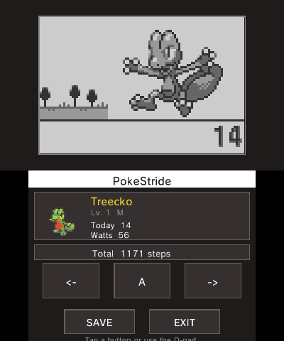

# PokeStride

**Turn your Nintendo 3DS into a PokéWalker.** PokeStride runs the original PokéWalker
firmware, so your 3DS becomes the little step-counter that came with Pokémon
HeartGold/SoulSilver — steps, watts, dowsing, battles and all.

It was built hand-in-hand with its sibling **[PkwBridge](https://github.com/edgarburgues/pkwbridge)**,
which moves Pokémon between your HeartGold/SoulSilver save and the walker. The two are
meant to be used together.

> It's a hobby project and it runs well, but a few things are still partial — see
> [What works](#what-works).

<p align="center"></p>

## Get it

1. Download `pokeStride.3dsx` from the [**Releases**](https://github.com/edgarburgues/pokestride/releases).
2. Copy it to `sdmc:/3ds/pokeStride/` on your SD card.
3. Put your own `pwflash.rom` and `pweep.rom` in that same folder.
4. Open it from the Homebrew Launcher.

`pwflash.rom` (the firmware) and `pweep.rom` (the save) are dumped from a real PokéWalker
— for example with [pokewalker-rom-dumper](https://github.com/francesco265/pokewalker-rom-dumper).
They belong to Nintendo and are **not** included here.

## Controls

| Button | Action |
|--------|--------|
| **A** / touch | the walker's ENTER button |
| **D-pad ◀ ▶** / touch | LEFT / RIGHT |
| **START** | quit (your progress is saved) |
| **Close the lid** | sleep + count steps; open it to add them to the game |

## What works

| | |
|---|---|
| ✅ | CPU, screen, buttons, and save (auto-saved to `pweep.rom`) |
| ✅ | IR: the physical link and exchanging commands with a real PokéWalker (CONNECT) |
| ✅ | Step counting while the 3DS lid is closed |
| ⚠️ | **Pairing with a real PokéWalker is partial** — the full handshake completes in testing with [pwdbg](https://github.com/edgarburgues/pwdbg), but not yet against real hardware |
| ⚠️ | **Audio is off for now** — the sound code is incomplete; planned for a later update |
| ⚠️ | **Steps only count with the lid closed** — they come from the console's own step counter, not the walker's motion sensor, so the lid has to be shut. This is a limitation on our side, not how the real walker behaves |
| ⚠️ | A few internal self-checks (watchdog / ADC / some clock counters) are skipped — not needed to run the firmware |

## Adding more games

PokeStride and PkwBridge were made together as a pair. Today they target
HeartGold/SoulSilver, but the design is meant to make adding other games — newer **and**
older — straightforward. The big remaining job for newer generations is recreating their
sprites; I'm not an artist, so that part is happily left to the community ❤️.

## Build it yourself

Needs devkitPro/devkitARM + libctru/citro2d/citro3d. With Docker (no local devkitPro):

```bash
MSYS_NO_PATHCONV=1 docker run --rm -v "$(pwd -W):/project" devkitpro/devkitarm:latest \
    bash -c "cd /project && make"
```

Or `make` with a native devkitPro install. Output: `pokeStride.3dsx`.

## Learn more

The **[wiki](https://github.com/edgarburgues/pokestride/wiki)** covers the architecture,
how the emulation works (CPU, LCD, EEPROM, IR), the CONNECT/pairing status, and the
bundled PokéWalker/3DS hardware reference docs.

## Credits & license

- App icon by **[Lalogo](https://lalogo.dev/)** ([github.com/la-lo-go](https://github.com/la-lo-go)).
- Based on the original emulator by [jpcerrone](https://github.com/jpcerrone/pokestride),
  though almost all of the code has since been rewritten and extended.
- PokéWalker reverse engineering by [Dmitry.gr](https://dmitry.gr/?r=05.Projects&proj=28.%20pokewalker);
  IR driver lineage: [libn3ds](https://github.com/profi200/libn3ds) →
  [pwalkerHax](https://github.com/francesco265/pwalkerHax) → pokewalker-rom-dumper.

Licensed under the **GNU GPLv3** — see [`LICENSE`](LICENSE). The PokéWalker ROM/EEPROM
dumps are Nintendo property and are not included.
